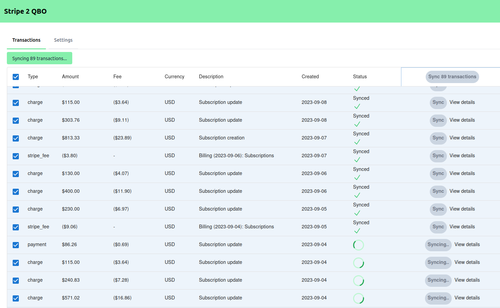

# Stripe to Quick Books Online

**Import your Stripe transactions into Quick Books Online.**

Connect your accounts, define your sync settings, and import your Stripe transactions into QBO with a single click.



I saved myself ~$100 USD/month by replacing some SaaS tools with this custom solution. Sharing it here in case it's useful to anyone else.

Working on generalizing/customizing this so that it is valuable beyond my use cases. Issues, feature requests, and PRs welcome!

## Installation

> Requires a QBO developer account and an QBO app with a client ID and secret. See [here](https://developer.intuit.com/app/developer/qbo/docs/develop/authentication-and-authorization/oauth-2.0)

> Requires a Stripe account with Connect enabled

### Server

`$ python3 -m venv venv`

`$ source venv/bin/activate`

`$ pip install -r requirements.txt`

`$ touch .env`

Add the following to `.env` with your own values:

```
SECRET_KEY=...

QBO_CLIENT_ID=...
QBO_CLIENT_SECRET=...
QBO_REDIRECT_URI=http://localhost:8000/qbo/oauth2/callback
QBO_BASE_URL=https://sandbox-quickbooks.api.intuit.com/v3/company

STRIPE_API_KEY=...
STRIPE_CLIENT_ID=...
STRIPE_REDIRECT_URL=http://localhost:8000/stripe/oauth2/callback
```

Make sure to update your QBO and Stripe settings with the correct redirect URLs.

### Client

`$ npm install`

## Running locally

Build client

`$ npm run build`

Run server

`$ python -m uvicorn stripe2qbo.api.app:app`

## Sync Settings

`Stripe Clearing Account` (**Required**)

The bank account in QBO that you want Stripe transactions to be synced to. This should track your Stripe Balance. (e.g. 'Stripe Balance')

`Stripe Payout Account` (**Required**)

The name of the bank account in QBO that you want Stripe Payouts to be transferred to. Probably your main bank account. (e.g. 'Chequing')

`Stripe Vendor` (**Required**)

The name of the vendor in QBO that you want Stripe fees to be sent to. (e.g. 'Stripe\)

`Stripe Expense Account` (**Required**)

The name of the expense account in QBO that you want Stripe fees to be categorized under. (e.g. 'Stripe Fees')

`Default Income Account ` (**Required**)

The name of the income account in QBO that you want Stripe sales to be categorized under. (e.g. 'Sales')

> Products on QBO will be automatically created for you, using the product name from Stripe. If this product exists on QBO already, it may already be linked to an income account. If you want to change this, you'll need to do it manually.

### Tax settings

For now, just two fields are required—a default tax code and an exempt tax code. The default tax code is used for all line items with non-zero tax. The exempt tax code is used for all line items with zero tax.

> When syncing invoices, any automatic tax calculations done by QBO will be overwritten to ensure the total tax amount matches the Stripe invoice.

`Default Tax Code` **(required if sales tax is enabled)**

The default tax code to use for all invoice line items with non-zero tax. (e.g. TAX, or HST ON)

`Exempt Tax Code` **(required if sales tax is enabled)**

The default tax code to use for all invoice line items with zero tax. (e.g. TAX or Exempt)

> 'TAX' and 'NON' are psuedo tax codes specific to US QBO accounts. If you're using a different QBO region, you'll need to change these. See [here](https://developer.intuit.com/app/developer/qbo/docs/develop/tutorials/transaction-tax-detail-entity-fields) for more info on setting up sales tax.

## Development

Ensure `pre-commit` is installed

`$ pip install pre-commit`

### Start dev server

`$ python -m uvicorn stripe2qbo.api.app:app --reload`

### Build and watch client

`$ npm run dev`

(The client will re-build on changes, but you may have to refresh the browser manually to see changes)

#### Tests

`$ pytest`

Requires `TEST_STRIPE_API_KEY` and `TEST_STRIPE_ACCOUNT_ID` env vars to be set.

When first running tests, you will need to ensure a `test_token` for QBO is saved. Run pytest with `-s` flag and follow the prompts to generate and save a token.

## ROADMAP:

Here's a rough roadmap of what's on the way to make this generally useful:

-   [ ] Show previously synced transactions on login
-   [ ] Show details of a synced transaction (e.g. Customer, Invoice, Products, Stripe fee)
-   [ ] Deploy with automated pipeline
-   [ ] Test with multiple QBO accounts -> tax enabled and not | multicurrency enabled and not | different regions (US vs. not)
-   [ ] Test with multiple Stripe accounts -> different currencies
-   [ ] Product settings to customize behaviour of individual products
-   [ ] Tax settings to customize behaviour of taxes
-   [ ] Handling time zones when parsing dates?
-   [ ] Migrations framework for DB
-   [ ] Support all Stripe transaction types/variants (e.g. refunds, transfers, etc.)
-   [ ] Create new QBO accounts from client
-   [ ] Prettify transaction table - pagination, sorting, filtering, etc. (MUI Data table)
-   [ ] Add more info to transaction table - e.g. fees, tax, customer, etc.
-   [ ] Speed up backend with concurrent requests
-   [ ] Support all currencies
-   [ ] Find matches / sync status from historical data
-   [ ] Sync payment methods (e.g. credit cards, ACH)
-   [ ] Multiple connections (Stripe, QBO) per user?
