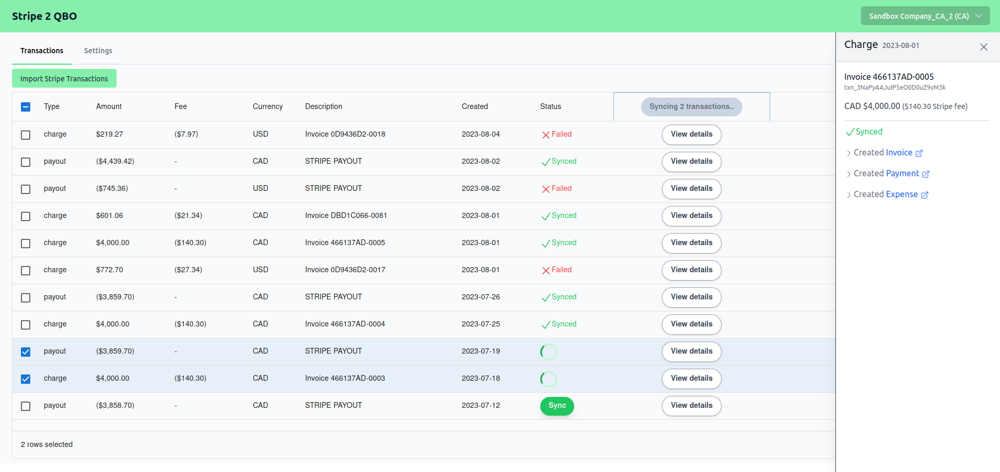

# Stripe to Quick Books Online

**Import your Stripe transactions into Quick Books Online.**

Connect your accounts, define your sync settings, and import your Stripe transactions into QBO with a single click.



I saved myself ~$100 USD/month by replacing some SaaS tools with this custom solution. Sharing it here in case it's useful to anyone else.

Working on generalizing/customizing this so that it is valuable beyond my use cases. Issues, feature requests, and PRs welcome!

## Installation

> Requires a QBO developer account and an QBO app with a client ID and secret. See [here](https://developer.intuit.com/app/developer/qbo/docs/develop/authentication-and-authorization/oauth-2.0)

> (Optionally) requires a Stripe account with Connect enabled

`$ npm install`

`$ python3 -m venv venv`

`$ source venv/bin/activate`

`$ pip install -r requirements.txt`

`$ touch .env`

Add the following to `.env` with your own values:

```
SECRET_KEY=<add your own secret key>

# QBO OAuth
QBO_CLIENT_ID=<Your QBO client id>
QBO_CLIENT_SECRET=<Your QBO client secret>
QBO_REDIRECT_URI=http://localhost:8000/qbo/oauth2/callback
QBO_BASE_URL=https://sandbox-quickbooks.api.intuit.com/v3/company
# For production QBO_BASE_URL=https://quickbooks.api.intuit.com/v3/company

STRIPE_API_KEY=<Your Stripe API key>

# Stripe Connect Oauth
STRIPE_CLIENT_ID=<Your Stripe client id, found in Connect settings>
STRIPE_REDIRECT_URL=http://localhost:8000/stripe/oauth2/callback
```

If you don't want to use Stripe Connect, you can set your Stripe account ID explicitly as an env variable

```
STRIPE_ACCOUNT_ID=<Your Stripe account id, found in Account settings>

```

> Make sure to update your QBO and Stripe Connect settings with the correct redirect URLs.

## Database

By default, a local SQLite database will be created with path=`./stripe2qbo.db`. You can use a postgres db by setting the
POSTGRES_URI env variable.

Initialize the database:

`$ alembic upgrade head`

## Development

Ensure `pre-commit` is installed

`$ pip install pre-commit`

Run FastAPI server in dev mode

`$ python -m uvicorn stripe2qbo.api.app:app --reload`

Run React client in dev mode

`$ npm run dev`

(Both client and server will re-build on changes, but you will have to refresh the browser manually to see ui changes)

To create migrations

`$ alembic revision --autogenerate -m "migration name"`

### Testing

`$ pytest`

Requires `TEST_STRIPE_API_KEY` and `TEST_STRIPE_ACCOUNT_ID` env vars to be set.

> When first running tests, you will need to ensure a `test_token` for QBO is saved. Run pytest with `-s` flag and follow the prompts to generate and save a token.

---

## Sync Settings

`Stripe Clearing Account` (**Required**)

The bank account in QBO that you want Stripe transactions to be synced to. This should track your Stripe Balance. (e.g. 'Stripe Balance')

`Stripe Payout Account` (**Required**)

The name of the bank account in QBO that you want Stripe Payouts to be transferred to. Probably your main bank account. (e.g. 'Chequing')

`Stripe Vendor` (**Required**)

The name of the vendor in QBO that you want Stripe fees to be sent to. (e.g. 'Stripe\)

`Stripe Expense Account` (**Required**)

The name of the expense account in QBO that you want Stripe fees to be categorized under. (e.g. 'Stripe Fees')

`Default Income Account ` (**Required**)

The name of the income account in QBO that you want Stripe sales to be categorized under. (e.g. 'Sales')

> Products on QBO will be automatically created for you, using the product name from Stripe. If this product exists on QBO already, it may already be linked to an income account. If you want to change this, you'll need to do it manually.

### Tax settings

For now, just two fields are required—a default tax code and an exempt tax code. The default tax code is used for all line items with non-zero tax. The exempt tax code is used for all line items with zero tax.

> When syncing invoices, any automatic tax calculations done by QBO will be overwritten to ensure the total tax amount matches the Stripe invoice.

`Default Tax Code` **(required if sales tax is enabled)**

The default tax code to use for all invoice line items with non-zero tax. (e.g. TAX, or HST ON)

`Exempt Tax Code` **(required if sales tax is enabled)**

The default tax code to use for all invoice line items with zero tax. (e.g. TAX or Exempt)

> 'TAX' and 'NON' are psuedo tax codes specific to US QBO accounts. If you're using a different QBO region, you'll need to change these. See [here](https://developer.intuit.com/app/developer/qbo/docs/develop/tutorials/transaction-tax-detail-entity-fields) for more info on setting up sales tax.

```

```
